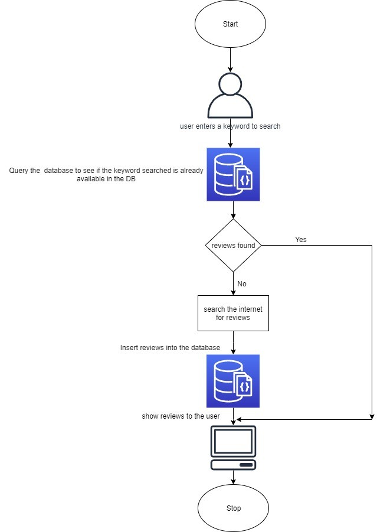
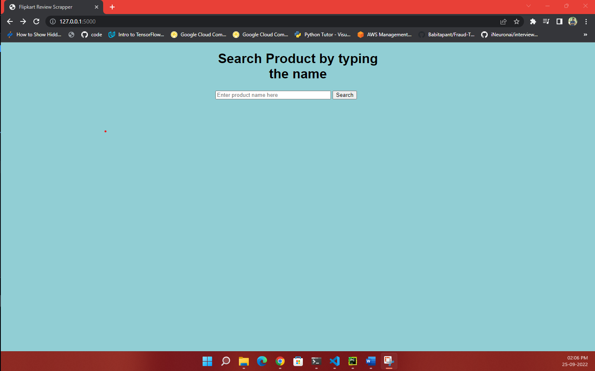
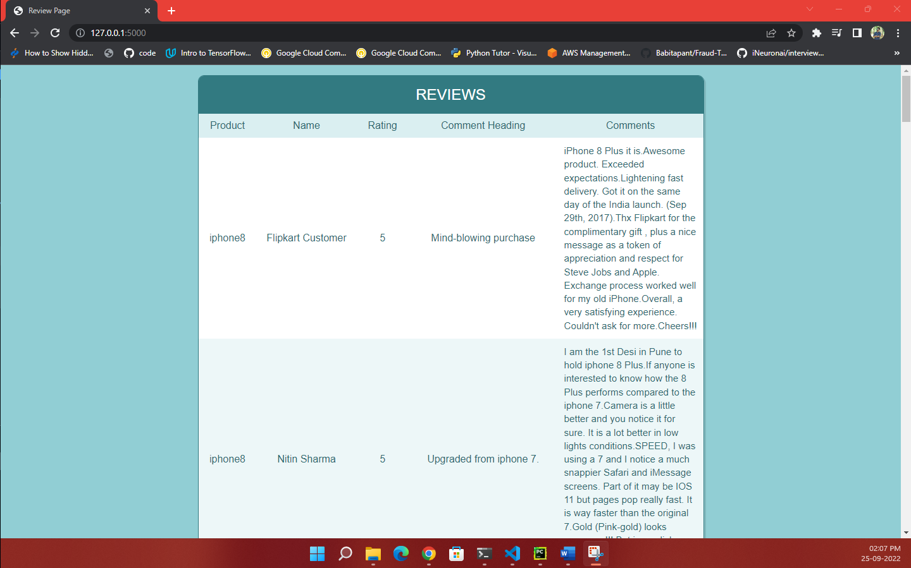

# Flipkart-Review-Scrapper

## Introduction
Web scraping is a technique using which the webpages from the internet are fetched and parsed to understand and extract specific information similar to a human being. Web scrapping consists of two parts:
- Web Crawling Accessing the webpages over the internet and pulling data from them.
- HTML Parsing Parsing the HTML content of the webpages obtained through web crawling and then extracting specific information from it.

In this project, we store the reviews in MongoDB so, that the next time a user searches similar type of product instead of searching again it retrieves them from the database and shows it to the user.

## Application Architecture:

## Sample snapshot

## *Home Page*

 ## *Result Page*

